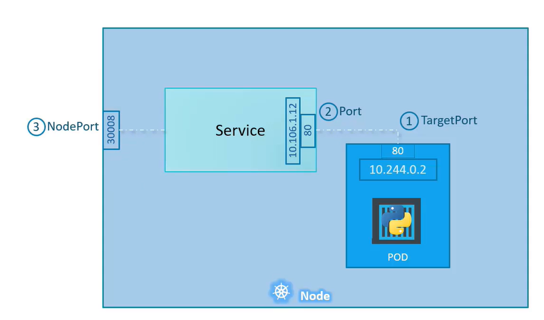

# Services
Services allow communication between various components within and outside of the application. Helps us to connect applications to other applications or users. It helps users access the application, as well as helps frontend pods communicate with backend pods and can help establish connectivity to an external database. This results in loose coupling between microservices in applications.

## NodePort
Lets say we have a kubernetes node which is in the same network as our laptop but the internal pod network and the pod are in a different network address. We are able to SSH into the node and access the pod from the node such as through a curl command. But this is not what we want. We want to access the application on the kubernetes node directly from our laptop. This is where we use Kubernetes Service. One of its use case is listening to a port on the node and forward the request to a port on the pod, running the application. This is known as a NodePort service and is similar to port mapping in Docker. 

The above diagram taken from KodeKloud illustrates how Services take requests from the NodePort and forward it to the TargetPort. NodePorts have a port range of 30000-32767. 

In the definition file for services, only the port is mandetory. If you do not provide a targetPort, it will assume it to be the same as the value of port. If you do not specify a NodePort, a random port is automatically allocated.

To create the service using the definition file, use the command `kubectl create -f <file_name>`. To see the services, use the `kubectl get services` command. 

If you have multiple pods with the same labels in the same node, the Service will automatically forward requests to any of these pods as long as the selector in the definition file matches up. 

If you have multiple pods with the same labels in the different nodes, Kubernetes will automatically create a service which automatically spans across all the nodes in the cluser and maps the target port to the same node ports in the cluster.

## ClusterIP
A full stack Kubernetes application usually has different pods hosting different parts of an application, i.e. frontend, backend and database. These servers need to communicate with each other. To establish connectivity, the best method is using a service which creates a single interface which groups all the relating pods together.

## Load Balancer
In order to have all your frontend pods to be reachable using only one domain name rather than using multiple IP addresses, you can use the Load Balancer type of Service. 